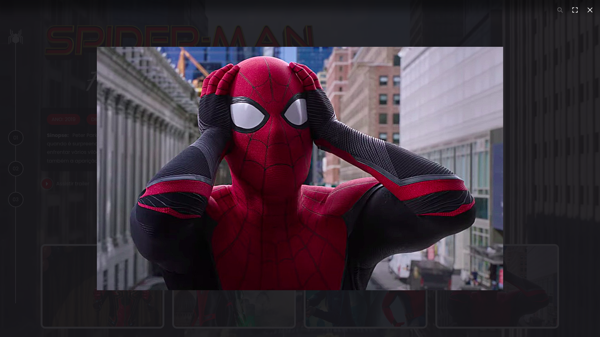

# Projeto Multiverso Spiderman

Link do projeto: https://didactic-note.surge.sh/index.html


Fonte: https://i0.wp.com/cromossomonerd.com.br/wp-content/uploads/2019/06/aranhaverso-capa.png?fit=1068%2C600&ssl=1


Um site criado para fins de aprendizado, feito junto à DIO. Não sou proprietária de nenhuma imagem, vídeo ou informações ali mostrados.


## Funcionalidades do projeto
 - [x] Visualização das três versões principais do Homem-Aranha interpretados por Tobey Maguire, Andrew Garfield e Tom Holland;
 - [x] Cada fotografia leva à página da respectiva versão;
 - [x] Cada versão possui em sua página botões que levam às páginas de cada filme;
 - [x] Nas páginas de cada filme, é possível ter acesso à sinopse, ano de lançamento, diretor, trailer e algumas fotos de cenas ou bastidores do filme.

##  Layout





## Demonstração
Acesse o site do projeto neste [link](https://dependent-thumb.surge.sh).

## Como rodar este projeto?

```
# Clone este repositório
$ git clone https://github.com/carolcampos22/projeto-multiverso-spiderman


# Vá até à pasta do projeto e abra o index.html diretamente no navegador.

```

## Tecnologias utilizadas

1. [HTML](https://developer.mozilla.org/pt-BR/docs/Web/HTML)
2. [CSS](https://developer.mozilla.org/pt-BR/docs/Web/CSS)
3. [JavaScript](https://developer.mozilla.org/pt-BR/docs/Web/JavaScript)

## Próximos passos

-  Miles Morales
-  Gwen Stacy
 
 
